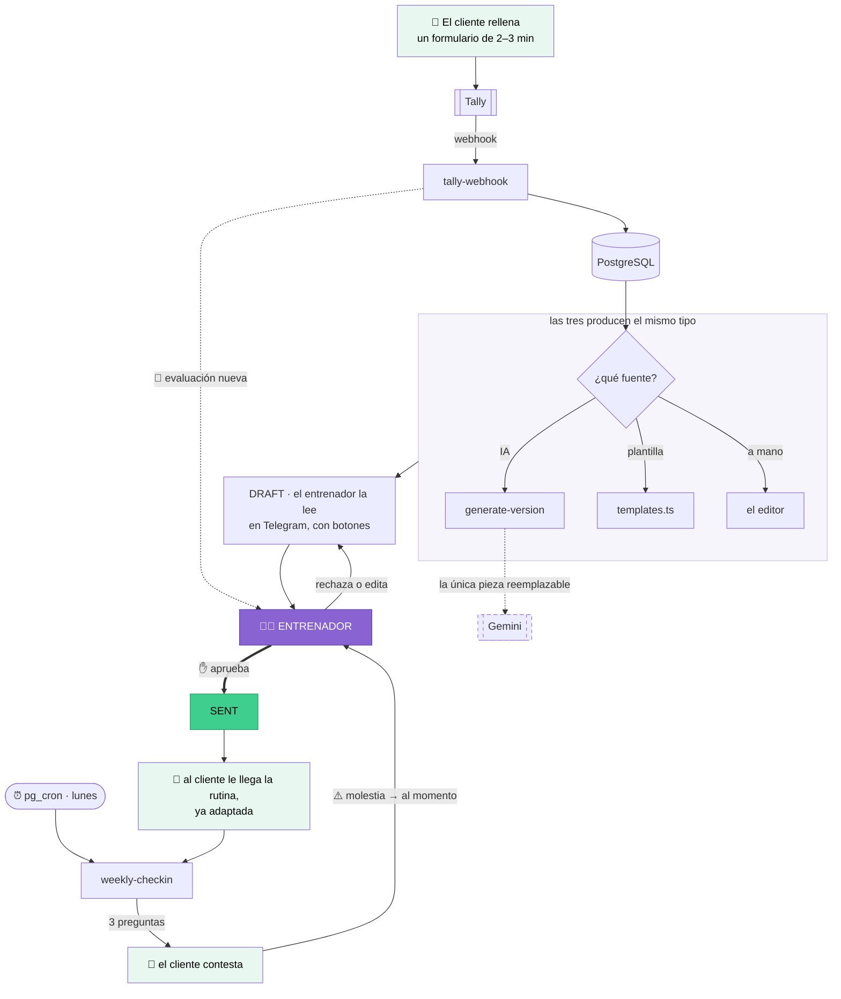
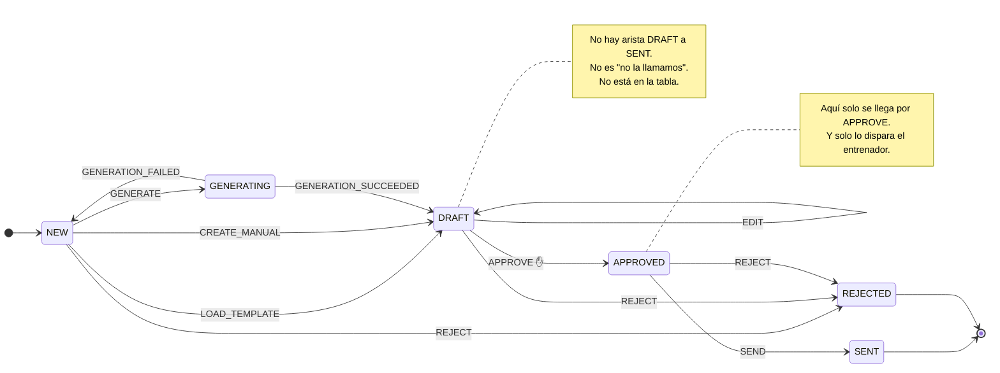
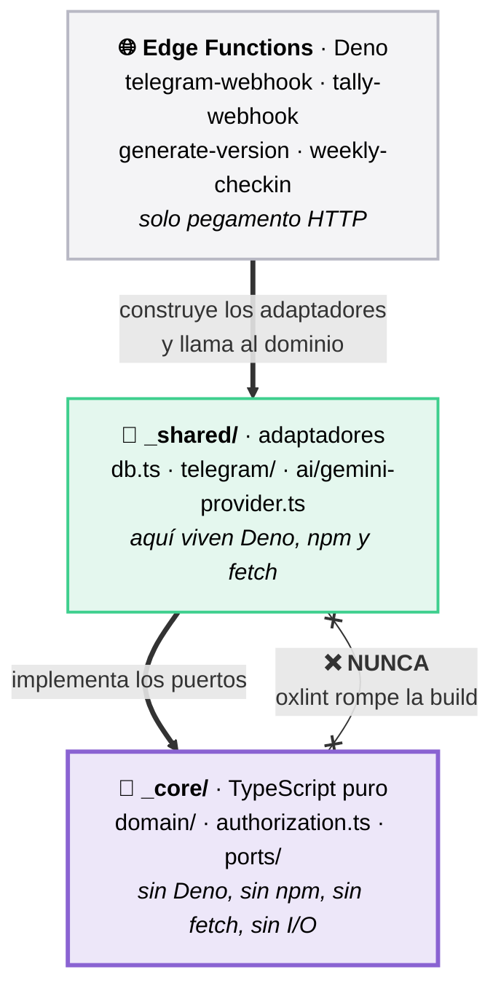

# 🏋️ TrainerFlow

[](https://github.com/ana-izaguirre/trainer-flow/actions/workflows/ci.yml)
[](docs/TESTING.md)

[](tsconfig.json)
[](supabase/functions/deno.json)
[](docs/DATA-MODEL.md)
[](docs/specs/)

[English](README.md) · **Español**

Herramienta que ayuda a un entrenador personal a crear y hacer seguimiento de
rutinas — **manualmente, con plantillas o con IA**, sin quitarle nunca la
decisión final.

> El badge de cobertura no es decorativo: si baja del 100%, **el CI se pone
> rojo**. El umbral está en `vitest.config.ts`.

---

## Qué hace



**La interfaz es Telegram.** No hay dashboard ni app. El entrenador ya lo tiene
abierto.

La línea de puntos hacia Gemini es el punto: es la única pieza reemplazable.
Todos los demás caminos funcionan sin ella.

---

## Los dos principios

### 1. La IA propone, el entrenador decide

Una rutina mal adaptada puede lesionar a alguien. Por eso la revisión humana no
es una convención, es estructura:



- **La transición `DRAFT → SENT` no existe.** El único camino a `SENT` sale de
  `APPROVED`, y ahí solo se llega con una acción del entrenador.
- Ningún cambio de estado ocurre fuera de la máquina de estados.
- Cobertura del 100% sobre ella, incluidas las transiciones inválidas.

`GENERATION_FAILED` vuelve a `NEW`, no a un estado muerto: el entrenador sigue
por plantilla o a mano, sobre la misma versión.

### 2. La IA es una capacidad, no la dueña del dominio

```
IA ──────────┐
Plantilla ───┼──► WorkoutDraft ──► validar ──► WorkoutVersion
Manual ──────┘
```

Las tres fuentes producen el mismo tipo y pasan por la misma validación.
**Si Gemini se cae, el producto sigue funcionando**: el entrenador usa una
plantilla o escribe la rutina a mano.

La palabra "Gemini" no aparece en `_core/`. El dominio solo conoce la interfaz
`AIProvider` — y hay un test que lo busca con `grep`.

---

## Cómo funciona por dentro

### Las capas, y qué puede importar cada una



`_core/` no usa `Deno.*`, ni `process.*`, ni `fetch`, ni imports `npm:`, ni nada
de `_shared`. **El linter lo hace cumplir** — no es una recomendación
(ADR-001). Es lo que permite que todo el dominio corra bajo Node y Vitest
mientras producción corre sobre Deno.

### Las cuatro decisiones que importan

**1. El webhook nunca espera a la IA.** Generar tarda 10–30s; Tally corta antes
y reintenta. El patrón es `recibir → guardar → responder 200 → disparar aparte`.

**2. Idempotencia por `UNIQUE (source, external_id)`.** Todo webhook inserta ahí
antes de hacer nada. Si Postgres lo rechaza, el evento ya se procesó. Es el
mecanismo, no un efecto colateral: una comprobación previa la pasarían las dos
peticiones simultáneas.

**3. Versionado con snapshot completo.** Una rutina enviada no se sobrescribe
nunca. Un cambio produce `version + 1`; la anterior queda intacta.

**4. Degradación controlada.** Sin margen de cuota o con la API caída, la versión
vuelve a `NEW` y el entrenador continúa por plantilla o manual.

### Estado

🚧 **En desarrollo.**

**El producto ya funciona sin IA.** `E2E-1` recorre el camino completo — crear,
editar, aprobar, enviar — y asevera que `ai_generations` queda con **cero
filas**. Ese hito no se deshace: lo que viene mejora el producto, no lo
habilita.

> ### Aquí no hay números ni tablas de progreso, a propósito
>
> Los tenía, y mentían. Decían «375 tests» cuando había 504, y listaban specs
> como borrador cuando ya tenían código. Un dato que hay que actualizar a mano
> en cada commit es un dato que va a estar mal.
>
> | Qué quieres saber | Dónde está, de verdad |
> |---|---|
> | Si todo pasa ahora mismo | El badge de CI, arriba |
> | En qué va cada spec | El campo **Estado** de cada [`spec`](docs/specs/) |
> | Qué sesión toca | [`ROADMAP.md`](docs/ROADMAP.md) |
> | Cuántos tests hay | `pnpm test:run` |
>
> Cada uno se actualiza solo, o vive junto a lo que describe.

### Los tres módulos con cobertura obligatoria del 100%

| Módulo | Qué garantiza |
|---|---|
| `authorization.ts` | Con RLS en denegación total, es lo único que separa a un cliente de los datos de otro |
| `domain/state-machine.ts` | Hace imposible que una rutina llegue al cliente sin aprobación |
| `domain/validate-draft.ts` | La frontera con la IA: nada entra al dominio sin pasar por aquí |

Si la cobertura de cualquiera baja del 100%, **el CI se pone rojo**. Eso no hay
que mantenerlo a mano: está en `vitest.config.ts`.

### Fuera de alcance en V1

Dashboard web · App móvil · Pagos · RAG · Biblioteca de ejercicios · Analytics ·
Multi-entrenador · Diffing entre versiones · Segundo proveedor de IA ·
Cualquier automatización sin supervisión humana.

### Terminado cuando

Un cliente completa el formulario, el entrenador crea la rutina (con IA,
plantilla o a mano), la aprueba, el cliente la recibe y hace check-in.

**Y cuando Gemini se cae, el entrenador sigue trabajando.**

---

## Por dónde empezar

| | |
|---|---|
| Desplegar por primera vez | [`docs/DEPLOY.md`](docs/DEPLOY.md) — un checklist de diez pasos |
| Cómo encajan las piezas | [`docs/ARCHITECTURE.md`](docs/ARCHITECTURE.md) |
| El esquema | [`docs/DATA-MODEL.md`](docs/DATA-MODEL.md) |
| Método de trabajo | [`CLAUDE.md`](CLAUDE.md) — primero la spec, después el código |

```bash
pnpm install
pnpm test:run     # el dominio, bajo Node
pnpm deno:test    # adaptadores y handlers, bajo Deno
```
