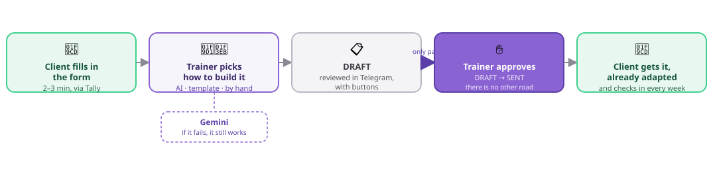
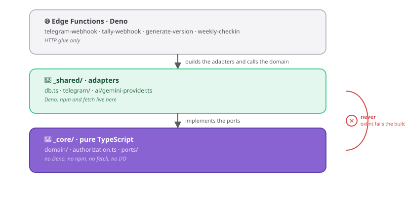

# 🏋️ TrainerFlow

[](https://github.com/ana-izaguirre/trainer-flow/actions/workflows/ci.yml)
[](docs/TESTING.md)
[](docs/TESTING.md)

[](tsconfig.json)
[](supabase/functions/deno.json)
[](docs/DATA-MODEL.md)
[](docs/specs/)

**English** · [Español](README.es.md)

A tool that helps a personal trainer build and follow up on workout plans —
**by hand, from a template, or with AI** — without ever taking the final call
away from them.

> The coverage badge isn't decorative: if it drops below 100%, **CI goes red**.
> The threshold lives in `vitest.config.ts`.

---

## What it does



**The interface is Telegram.** No dashboard, no app — the trainer already has
it open. Gemini is the only replaceable part: every other path works without
it, and the weekly check-in (not pictured) escalates straight to the trainer
on any discomfort.

---

## The two principles

### 1. The AI proposes, the trainer decides

A badly adapted workout can injure someone. So human review isn't a convention
here — it's structure:

- **The `DRAFT → SENT` transition does not exist.** The only road to `SENT`
  starts at `APPROVED`, and the only way there is a trainer's action — not
  AI, not a cron job, not a retry.
- No state change happens outside the state machine, and it has 100% test
  coverage, invalid transitions included.
- `GENERATION_FAILED` goes back to `NEW`, not to a dead end: the trainer
  carries on with a template or writes it by hand, on the same version.

### 2. The AI is a capability, not the owner of the domain

```
AI ──────────┐
Template ────┼──► WorkoutDraft ──► validate ──► WorkoutVersion
By hand ─────┘
```

All three sources produce the same type and go through the same validation.
**If Gemini goes down, the product keeps working**: the trainer uses a template
or writes the plan by hand.

The word "Gemini" does not appear in `_core/`. The domain only knows the
`AIProvider` interface — and a test greps for it.

---

## How it works inside

### The layers, and what each one may import



`_core/` uses no `Deno.*`, no `process.*`, no `fetch`, no `npm:` imports and
nothing from `_shared`. **The linter enforces it** — it isn't a guideline
(ADR-001). That's what lets the whole domain run under Node and Vitest while
production runs on Deno.

### The four decisions that matter

**1. A webhook never waits for the AI.** Generating takes 10–30s; Tally times
out before that and retries. The pattern is
`receive → store → answer 200 → fire separately`.

**2. Idempotency through `UNIQUE (source, external_id)`.** Every webhook
inserts there before doing anything else. If Postgres rejects it, the event was
already processed. It's the mechanism, not a side effect: a prior check would
let two concurrent requests both through.

**3. Versioning with a full snapshot.** A plan that was sent is never
overwritten. A change produces `version + 1`; the previous one stays intact.

**4. Controlled degradation.** Out of quota or with the API down, the version
goes back to `NEW` and the trainer carries on with a template or by hand.

### Status

🚧 **In development.**

**The product already works without AI.** `E2E-1` walks the whole path — create,
edit, approve, send — and asserts `ai_generations` ends with **zero rows**. That
milestone doesn't come undone: what comes next improves the product, it doesn't
enable it.

> ### There are no counts or progress tables here, on purpose
>
> There used to be, and they lied. They said "375 tests" when there were 504,
> and listed specs as drafts when they already had code. A number you have to
> update by hand on every commit is a number that will be wrong.
>
> | What you want to know | Where it actually lives |
> |---|---|
> | Whether everything passes right now | The CI badge, up top |
> | How each spec is doing | The **Estado** field in each [`spec`](docs/specs/) |
> | Which session is next | [`ROADMAP.md`](docs/ROADMAP.md) |
> | How many tests there are | `pnpm test:run` |
>
> Each of those updates itself, or lives next to what it describes.

### The three modules at a mandatory 100%

| Module | What it guarantees |
|---|---|
| `authorization.ts` | With RLS denying everything, it's the only thing keeping one client's data from another |
| `domain/state-machine.ts` | Makes it impossible for a plan to reach a client unapproved |
| `domain/validate-draft.ts` | The border with the AI: nothing enters the domain without passing through |

If any of them drops below 100%, **CI goes red**. That doesn't need
maintaining by hand — it's in `vitest.config.ts`.

### Out of scope for V1

Web dashboard · Mobile app · Payments · RAG · Exercise library · Analytics ·
Multi-trainer · Diffing between versions · A second AI provider · Any
automation without human supervision.

### Done when

A client fills in the form, the trainer builds the plan (with AI, a template or
by hand), approves it, the client receives it and checks in.

**And when Gemini goes down, the trainer keeps working.**

---

## Quick start

No secret needed — the domain runs standalone (that's what "works without AI" means).

```bash
git clone https://github.com/ana-izaguirre/trainer-flow.git && cd trainer-flow
pnpm install
pnpm test:run                              # domain, under Node — no setup
pnpm deno:test                             # adapters, under Deno
supabase start && pnpm test:integration    # needs Docker
```

| | |
|---|---|
| Deploying for real | [`docs/DEPLOY.md`](docs/DEPLOY.md) — a ten-step checklist |
| When something breaks | [`docs/RUNBOOK.md`](docs/RUNBOOK.md) — the database is the index, the logs are the detail |
| How the pieces fit | [`docs/ARCHITECTURE.md`](docs/ARCHITECTURE.md) |
| The schema | [`docs/DATA-MODEL.md`](docs/DATA-MODEL.md) |
| Working method | [`CLAUDE.md`](CLAUDE.md) — spec first, code second |
